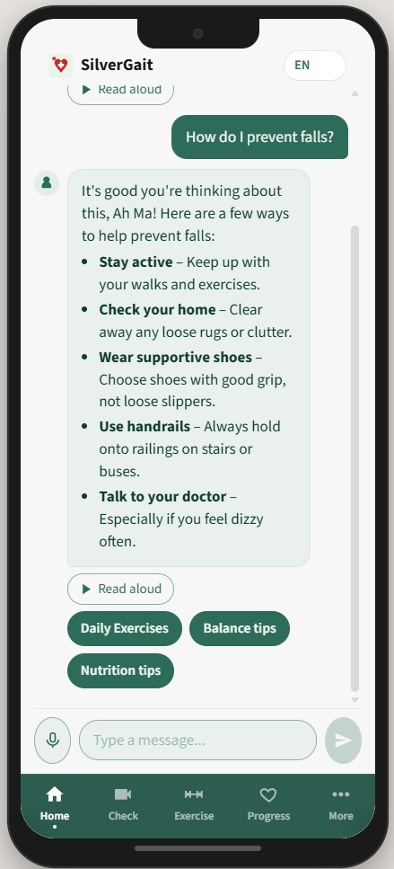
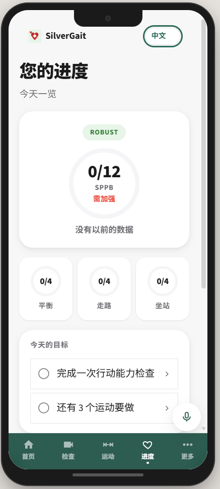
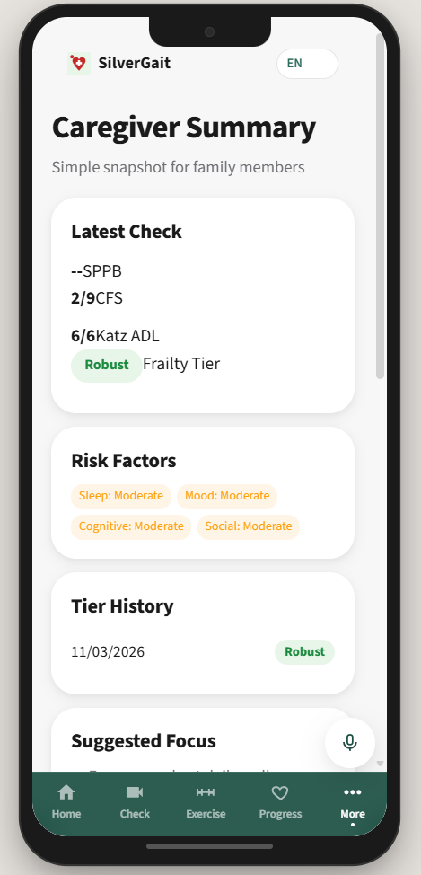
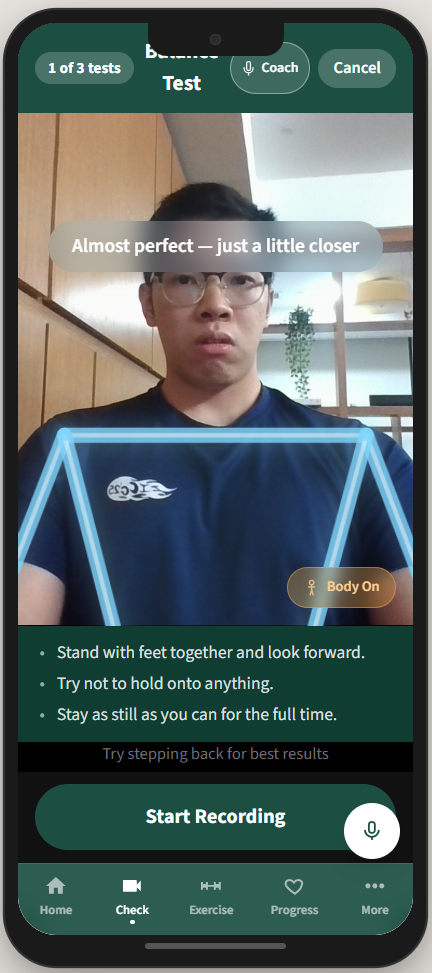
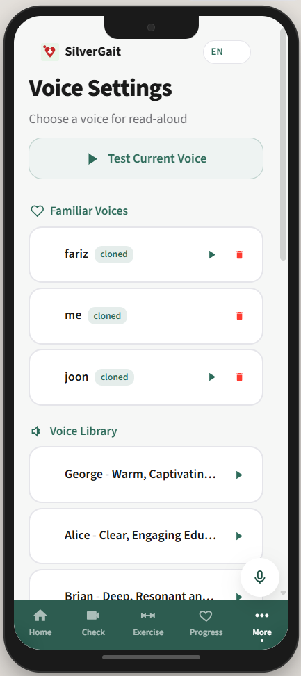
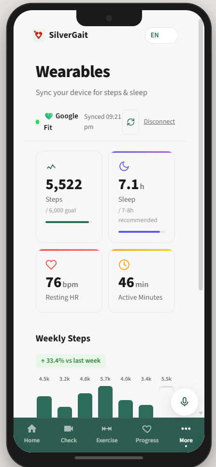

# SilverGait

A **multimodal agentic system** for at-home elderly frailty assessment and management in Singapore.

<p align="center">
  
  &nbsp;
  
  &nbsp;
  
</p>

## Problem

Singapore is one of the fastest-ageing societies in Asia. Frailty and mobility decline are leading predictors of falls, hospitalisation, and loss of independence among the elderly — yet clinical assessments like the SPPB require in-person visits with trained professionals, making regular screening impractical. Most seniors are unaware of their frailty status until a fall or hospitalisation occurs.

As AI-driven healthcare solutions gain momentum in Singapore ([NUS-Synapxe-IMDA AI Innovation Challenge 2026](https://www.imda.gov.sg/resources/press-releases-factsheets-and-speeches/press-releases/2026/ai-solutions-combating-chronic-diseases)), there is a clear need for tools that enable **continuous remote monitoring** and **empower patients to manage their health from home**.

## Solution

SilverGait enables elderly users to perform standardized SPPB assessments at home using only a smartphone camera — no wearables, no clinic visits. The system combines **computer vision**, **deterministic clinical scoring**, and a **multilingual agentic chat system** to deliver continuous, personalized frailty management.

**Modalities:** Video (pose estimation + vision LLM), voice (STT/TTS in 4 languages), text (chat agent), structured health data (Katz ADL, CFS, SPPB scoring)

## Features

- **Video-based SPPB assessment** — Phone camera records balance, gait, and chair-stand tests. MoveNet extracts 2D kinematics on-device; Gemini Vision scores each test 0-4. Combined SPPB (0-12) drives frailty classification. [How it works](docs/kinematics-and-sppb.md) | [Research](docs/research.md)

  <p align="center"></p>
- **Deterministic frailty pipeline** — Katz ADL (0-6), CFS (1-9), and SPPB feed a rule-based classifier (0 LLM calls). Tier changes auto-generate care plans and caregiver alerts. Append-only snapshots for full audit trail.
- **Agentic chat with sub-agents** — Gemini 2.5 Flash orchestrator with function calling dispatches to Exercise, Sleep, Education, and Monitoring sub-agents. Safety gate detects falls, emergencies, and distress in all four languages.
- **Caregiver voice cloning** — ElevenLabs clones a caregiver's voice for all TTS output. Elderly are more likely to engage with and comply with instructions from a familiar voice — exercise coaching, assessment guidance, and chat responses all sound like a trusted family member rather than a generic AI.

  <p align="center"></p>
- **Multilingual voice-first** — English, Mandarin, Malay, Tamil. MERaLiON AudioLLM (NUS/A*STAR) handles Singlish accents and code-switching. Voice input on every screen so users never have to type.
- **Personalized exercise & sleep plans** — Exercise plans selected by frailty tier from a curated library, then personalized by SPPB deficits. Sleep Agent generates CBT-I plans — the recommended first-line treatment over pharmacological aids which carry fall risks.
- **Elderly-optimized UI** — 18px+ fonts, 48px+ touch targets, high-contrast warm palette. One decision at a time, bottom nav, voice on all input screens. Clinical detail reserved for the caregiver dashboard.

  <p align="center"></p>

## Architecture

Two LangGraph pipelines with management sub-agents:

```
Assessment Graph (0 LLM calls)          Chat Graph (1-5 LLM calls)
Score -> Classify -> Tier Change?       Context Assembly -> Agent (Gemini)
  YES -> Update Plans -> Notify             | function_call |
  NO  -> Persist                        Exercise / Sleep / Education / Monitoring
         | writes DB                    Progress Summary / Alert Caregiver
         +----------> Database <--------    -> Safety Gate -> Persist
```

Design philosophy: **LLM only where reasoning is needed.** Scoring, classification, routing, and plan selection are fully deterministic. LLM calls are reserved for video analysis, conversational reasoning, and personalized content generation.

See [`docs/ARCHITECTURE.md`](docs/ARCHITECTURE.md) for detailed specs, state schemas, and DB schema.
See [`docs/kinematics-and-sppb.md`](docs/kinematics-and-sppb.md) for our CV/kinematics approach and research references (35+ peer-reviewed papers).
See [`docs/research.md`](docs/research.md) for the clinical evidence and scientific rationale behind the system.
Open [`langgraph-diagrams.html`](langgraph-diagrams.html) in a browser for interactive flow diagrams.

## Prerequisites

- **Python 3.10+** (with pip)
- **Node.js 18+** (with pnpm — install via `npm i -g pnpm` or use Corepack)
- **Gemini API key** — get one from [Google AI Studio](https://aistudio.google.com/app/apikey)

## Setup

1. Clone and enter the repo:
   ```bash
   git clone <repo-url>
   cd SilverGait
   ```

2. Create your `.env` file:
   ```bash
   cp .env.example .env
   ```
   Then edit `.env` and add your API keys (see [Environment Variables](#environment-variables) below).

3. Run the app:

   **Linux / macOS:**
   ```bash
   chmod +x run.sh
   ./run.sh
   ```

   **Windows:**
   ```cmd
   run.bat
   ```

   The script creates a virtual environment, installs dependencies, starts the backend and frontend, and prints the URLs:
   - Frontend: http://localhost:5173
   - Backend API: http://localhost:8000
   - API Docs: http://localhost:8000/api/docs

4. Open the frontend on your phone (same network) or use `share.sh` for a public URL:
   ```bash
   chmod +x share.sh
   ./share.sh
   ```

## Environment Variables

Create a `.env` file in the project root (see `.env.example`):

| Variable | Required | Purpose |
|----------|----------|---------|
| `GEMINI_API_KEY` | Yes | Video analysis (SPPB scoring), chat agent, fallback STT/TTS |
| `mera_API_KEY` | No | MERaLiON Singlish-aware STT via cr8lab API |
| `ELEVENLABS_API_KEY` | No | High-quality TTS + voice cloning |

The app runs with only `GEMINI_API_KEY`. Optional keys enable higher-quality voice features.

## Tech Stack

| Layer | Technology |
|-------|-----------|
| Frontend | React 18, TypeScript, Vite, Zustand, CSS variables |
| Backend | FastAPI, Python 3.10+, SQLAlchemy async, SQLite (aiosqlite) |
| AI | Gemini 2.5 Flash (chat + video), Gemini Flash Lite (sub-agents) |
| STT | MERaLiON AudioLLM (primary, Singlish) -> Gemini (fallback) |
| TTS | ElevenLabs (primary) -> Gemini (fallback) |
| Orchestration | LangGraph (Assessment Graph + Chat Graph) |

## Project Structure

```
SilverGait/
├── .env.example              # API key template
├── run.sh / run.bat          # Start backend + frontend
├── share.sh                  # Public URL via localtunnel
├── langgraph-diagrams.html   # Interactive architecture diagrams
│
├── demo/                     # Screenshots, GIFs, demo videos
├── docs/
│   ├── ARCHITECTURE.md       # Detailed specs, state schemas, DB schema
│   ├── kinematics-and-sppb.md # CV pipeline, biomechanics, research refs
│   └── research.md           # Clinical evidence and scientific rationale
│
├── backend/
│   ├── requirements.txt
│   └── app/
│       ├── main.py
│       ├── core/             # config, database
│       ├── models/           # SQLAlchemy ORM + Pydantic schemas
│       ├── routers/          # API endpoints
│       └── services/
│           ├── scoring.py          # Katz, CFS, SPPB, classify_frailty
│           ├── content_library.py  # Curated plans by tier/risk
│           ├── context.py          # UserContext + build_user_context()
│           ├── gemini_vision.py    # Video -> Gemini -> SPPB scores
│           ├── meralion.py         # MERaLiON STT (cr8lab API)
│           └── langgraph_agents/
│               ├── assessment_graph.py   # 6-node deterministic pipeline
│               ├── chat_graph.py         # 4-node Gemini chat pipeline
│               └── management_agents.py  # Exercise/Sleep/Education/Monitoring
│
└── frontend/
    └── src/
        ├── components/       # OnboardingModal, AppHeader, BottomNav, etc.
        ├── pages/            # HomePage, AssessmentPage, ExercisesPage, etc.
        ├── hooks/            # useAssessmentFlow, usePoseDetection, etc.
        ├── stores/           # Zustand (user, assessment, chat)
        ├── services/         # API client (api.ts)
        └── i18n/             # en, zh, ms, ta translations
```

## API Endpoints

| Method | Path | Description |
|--------|------|-------------|
| POST | `/api/assessment/analyze-stream` | Video upload -> Gemini -> SPPB scores (SSE) |
| POST | `/api/chat/stream` | Chat message -> agent response (SSE) |
| POST | `/api/users/{id}/health-snapshot` | Save health answers, trigger assessment pipeline |
| GET | `/api/users/{id}/context` | Full user context for frontend |
| POST | `/api/exercises/complete` | Log completed exercise |
| GET | `/api/exercises/personalized/{id}` | Tier-based exercise plan |
| POST | `/api/voice/tts-stream` | Text-to-speech (ElevenLabs / Gemini) |
| POST | `/api/voice/turn` | Speech-to-text + response |

Full API docs available at http://localhost:8000/api/docs when running.

## Demo

Place screenshots, GIFs, and demo videos in the `demo/` folder. Example usage in this README:

```markdown


```

Demo videos for the CV/kinematics pipeline (balance, gait, chair-stand tests) go in `demo/` as well. See [`docs/kinematics-and-sppb.md`](docs/kinematics-and-sppb.md) for what the pipeline does.

## Development

**Backend only:**
```bash
cd backend
pip install -r requirements.txt
python -m uvicorn app.main:app --reload --port 8000
```

**Frontend only:**
```bash
cd frontend
pnpm install
pnpm run dev
```
